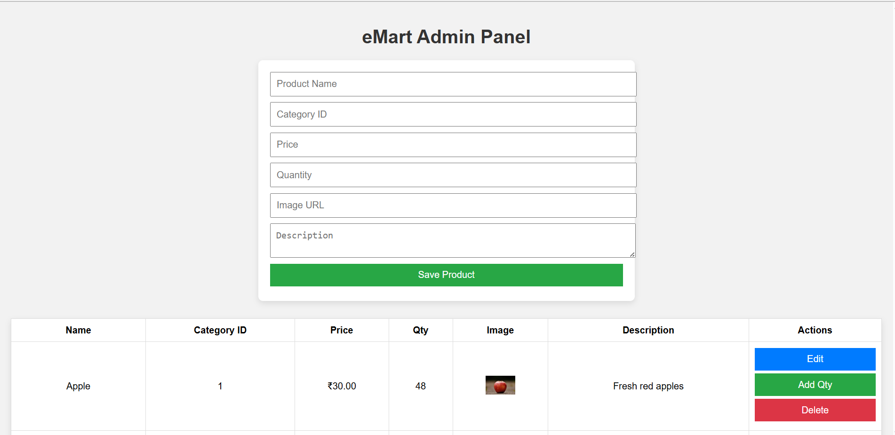
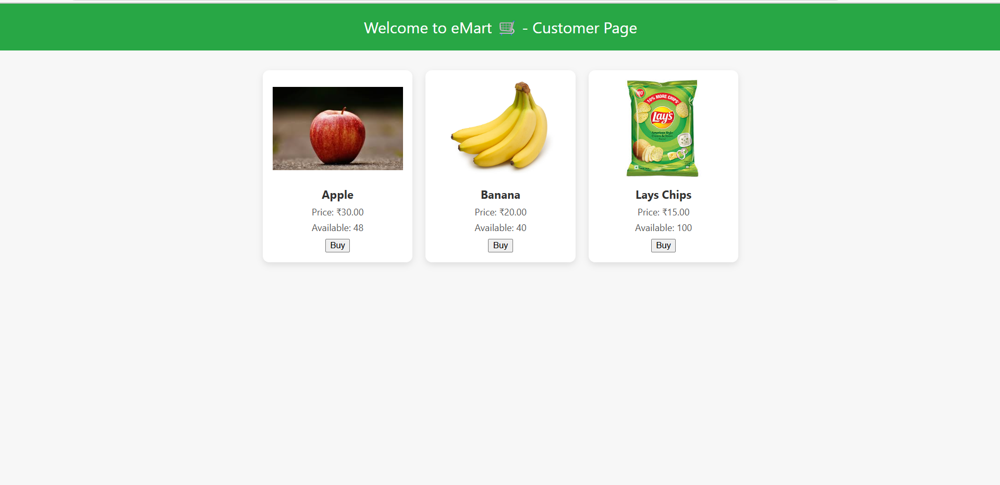
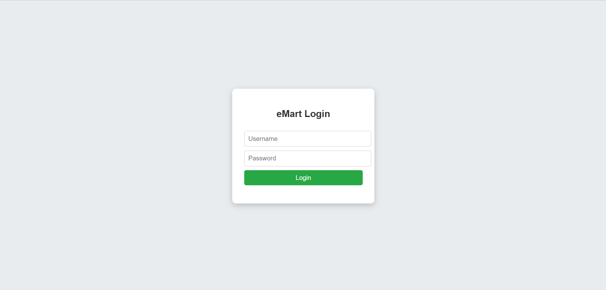
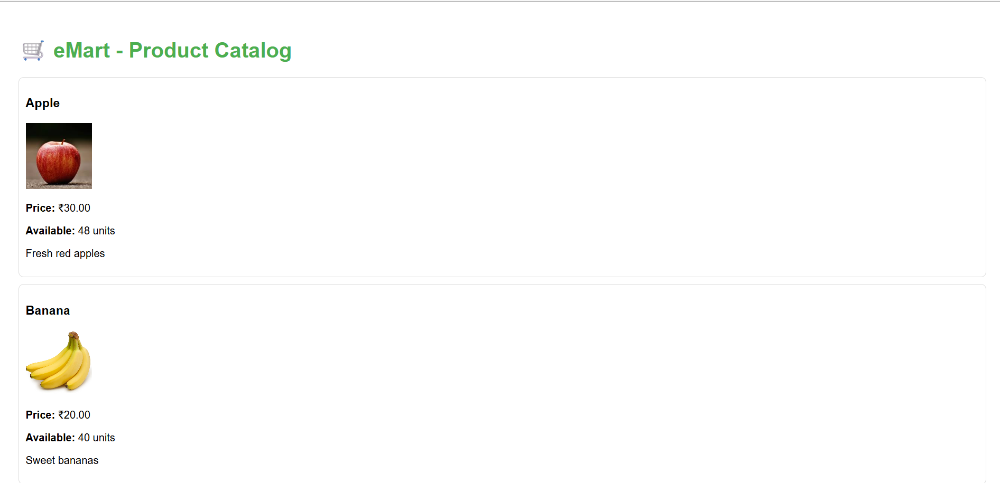

# Emart Grocery (Full Stack Web App)


## Overview
eMart is a web application with separate frontend and backend components. It supports user login with role-based redirection for customers and admins.




## Project Structure
- `backend/`: Contains the Node.js backend server and API routes.
- `frontend/`: Contains the HTML, CSS, and JavaScript files for the frontend UI.

## Backend Setup
1. Navigate to the backend directory:
   ```
   cd backend
   ```
2. Install dependencies:
   ```
   npm install
   ```
3. Start the backend server:
   ```
   npm start
   ```
   The server runs on `http://localhost:5000` and connects to a MySQL database.

## Frontend Usage
- Open `frontend/login.html` in a web browser.
- Enter your username and password to log in.
- Based on your role, you will be redirected to:
  - `admin.html` for admin users.
  - `shop.html` for customer users.

## Login Credentials for Testing
- Admin:
  - Username: `admin`
  - Password: `admin123`
- Customer:
  - Username: `customer1`
  - Password: `cust123`

## Notes
- The backend API endpoint for login is `POST /api/auth/login`.
- The login page sends credentials to the backend and handles role-based redirection.
- Ensure the backend server is running before attempting to log in.
- Clear browser cache or do a hard reload if frontend changes are not reflected.

## Troubleshooting
- If login fails, verify the backend server is running and the database is connected.
- Check the browser console for errors.
- Confirm you are using the correct login credentials.

## Dependencies
- Backend:
  - express
  - mysql2
  - bcrypt
  - body-parser
  - cors
- Frontend:
  - Plain HTML, CSS, and JavaScript

## Contact
For further assistance, please contact the project maintainer.
